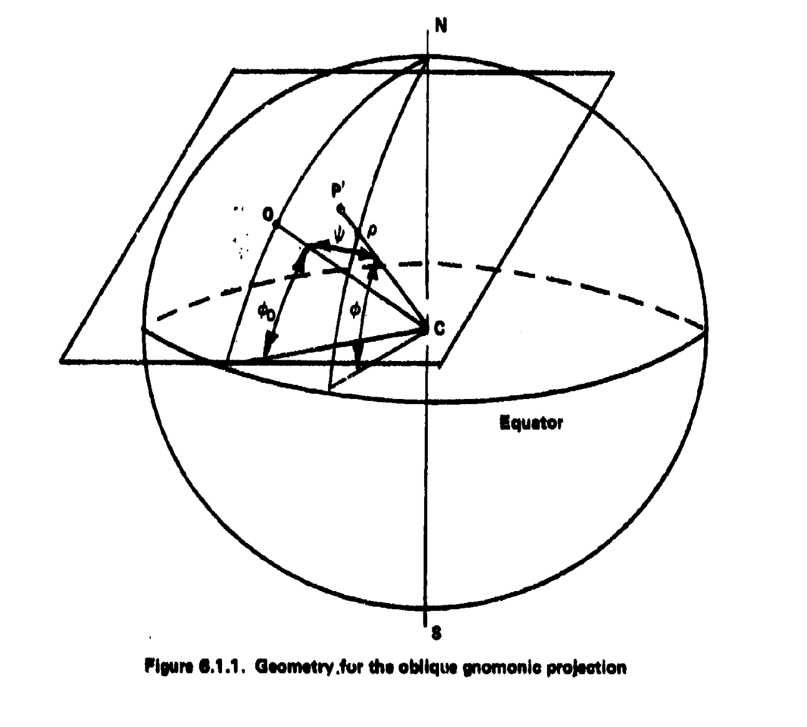

## 6.1 Gnomonic Projection [8], [20]

The gnomonic projection requires that the transformation of positions on the surface of the earth onto a plane be based upon a projection point at the center of the earth. The name comes from a gnome’s-eye view of the world. The gnomonic projection can be a purely geometrical construction. However, we shall use spherical trigonometry to obtain the oblique gnomonic projection. Then, the two limiting cases of the projection, the polar and the equatorial, will be obtained by particularizing the oblique case.

Figure 6.1.1 portrays the geometry required for deriving the oblique gnomonic projection. Let a plane be tangent to the sphere at point \(O\), whose coordinates are \((\phi_0, \lambda_0)\). The Cartesian axes on the plane are such that \(x\) is east, and \(y\) is north. Let an arbitrary point \(P\), with coordinates \((\phi, \lambda)\), be projected onto the plane to become \(P'\), with mapping coordinates \((x, y)\).

Define an auxiliary angle, \(\psi\), between the radius vectors \(CO\) and \(CP\). From the figure:

$$
OP' = a \,\tan \psi
\quad (6.1.1)
$$

---

---
## Continued Derivation of the Oblique Gnomonic Projection

On the mapping plane, define a second auxiliary angle, \(\theta\), which orients \(OP'\) with respect to the \(x\)-axis. From the geometry:

$$
x = OP' \cos \theta
\quad (6.1.2)
$$

Substituting \((6.1.1)\) \(\bigl(OP' = a \,\tan \psi\bigr)\) into \((6.1.2)\), we get:

$$
x = a \,\tan \psi \,\cos \theta
    = \frac{a \,\sin \psi}{\cos \psi} \,\cos \theta
\quad (6.1.3)
$$

Similarly,

$$
y = OP' \sin \theta
\quad (6.1.4)
$$

Substituting \((6.1.1)\) into \((6.1.4)\):

$$
y = a \,\tan \psi \,\sin \theta
    = \frac{a \,\sin \psi}{\cos \psi} \,\sin \theta
\quad (6.1.5)
$$

---

It is now necessary to find \(\psi\) and \(\theta\) in terms of \(\phi\), \(\phi_0\), \(\lambda\), and \(\lambda_0\). 

From Figure 6.1.1, by the use of the **law of sines**:

$$
\frac{\sin(\lambda - \lambda_0)}{\sin \psi}
    = \frac{\sin\bigl(90^\circ - \theta\bigr)}{\sin\bigl(90^\circ - \phi\bigr)}
    = \frac{\cos \theta}{\cos \phi},
$$

which leads to

$$
\sin \psi \,\cos \theta
    = \sin(\lambda - \lambda_0)\,\cos \phi.
\quad (6.1.6)
$$

---

### Apply the Law of Cosines

$$
\cos \psi
    = \cos\bigl(90^\circ - \phi_0\bigr)\,\cos\bigl(90^\circ - \phi\bigr)
    + \sin\bigl(90^\circ - \phi_0\bigr)\,\sin\bigl(90^\circ - \phi\bigr)\,\cos(\lambda - \lambda_0).
$$

Recognizing that \(\cos(90^\circ - \alpha) = \sin \alpha\) and \(\sin(90^\circ - \alpha) = \cos \alpha\), we obtain:

$$
\cos \psi
    = \sin \phi_0 \,\sin \phi
    + \cos \phi_0 \,\cos \phi \,\cos(\lambda - \lambda_0).
\quad (6.1.7)
$$

---

### Apply Equation (2.10.6)

In some references, an additional relation is used (analogous to \(\cos \alpha \,\cos h\) from earlier sections). Substituting it here yields:

$$
\sin \psi \,\cos\bigl(90^\circ - \theta\bigr)
    = \sin\bigl(90^\circ - \phi_0\bigr)\,\cos\bigl(90^\circ - \phi\bigr)
    - \cos\bigl(90^\circ - \phi_0\bigr)\,\sin\bigl(90^\circ - \phi\bigr)\,\cos(\lambda - \lambda_0).
$$

Using the same trigonometric identities for \(\sin\) and \(\cos\) of \((90^\circ - \alpha)\), one can transform the above for consistency with the \(\phi\), \(\phi_0\), \(\lambda\), and \(\lambda_0\) terms.

## Continued Derivation (Oblique Gnomonic Projection)

From the geometry, an additional relationship is:

$$
\sin \psi \,\sin \theta
    = \cos \phi_0 \,\sin \phi 
      \;-\; \sin \phi_0 \,\cos \phi \,\cos(\lambda - \lambda_0).
\quad (6.1.8)
$$

---

### Substitutions Leading to the Plotting Equations

- **Substitute** \((6.1.6)\) and \((6.1.7)\) into \((6.1.3)\).
- **Substitute** \((6.1.7)\) and \((6.1.8)\) into \((6.1.5)\).

After simplification, the resulting **oblique gnomonic** plotting equations become:

$$
x 
= \frac{a \,S \,\cos \phi \,\sin(\lambda - \lambda_0)}
       {\sin \phi_0 \,\sin \phi + \cos \phi_0 \,\cos \phi \,\cos(\lambda - \lambda_0)},
$$

$$
y 
= \frac{a \,S \bigl[\cos \phi_0 \,\sin \phi 
           \;-\; \sin \phi_0 \,\cos \phi \,\cos(\lambda - \lambda_0)\bigr]}
       {\sin \phi_0 \,\sin \phi + \cos \phi_0 \,\cos \phi \,\cos(\lambda - \lambda_0)}.
\quad (6.1.9)
$$

Here, \(a\) is the Earth’s radius (sometimes denoted \(R\) in other texts), and \(S\) is the scale factor (often taken as 1 for conceptual derivations).

These equations \((6.1.9)\) define the oblique gnomonic projection.  
- When \(\phi_0 = 45^\circ\) and \(\lambda_0 = 0^\circ\), the resulting grid (Figure 6.1.2) shows that all meridians and the equator are straight lines (being great circles).  
- A great circle between points \(A\) and \(C\) on this oblique plane appears as a straight line, whereas the loxodrome (rhumb line) between these same points is curved.

---

### Special Case: Polar Gnomonic Projection

To find the **gnomonic polar** projection, set \(\phi_0 = 90^\circ\) in \((6.1.9)\). This yields:

$$
x = -\,aS \,\cot \phi \,\sin(\lambda - \lambda_0)
\quad (6.1.10)
$$

and

$$
y = \frac{aS \,\cos \phi \,\cos(\lambda - \lambda_0)}{\sin \phi}
  \;=\;
  aS \,\cot \phi \,\cos(\lambda - \lambda_0).
\quad (6.1.11)
$$

A **polar gnomonic** grid (Figure 6.1.3) based on \((6.1.10)\) and \((6.1.11)\) has all meridians as straight lines and parallels as concentric circles, with spacing increasing as latitude decreases. The equator itself cannot be portrayed on this polar gnomonic projection, since a ray from the center of the Earth to any point on the equator will be parallel to the projection plane.