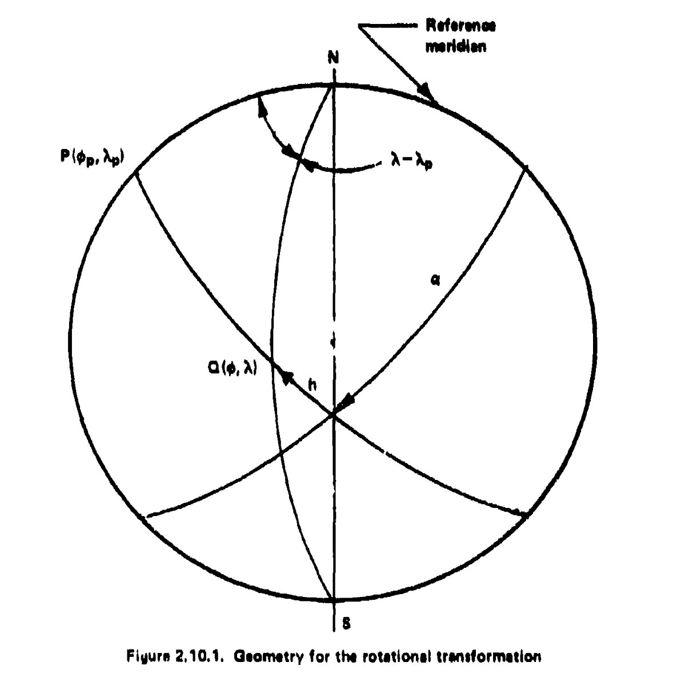

## 2.10 Rotation of the Coordinate System [20]

A rotation of the coordinate system can be defined to conveniently obtain oblique, transverse, and equatorial projections from polar projections. This can be done by applying formulas of spherical trigonometry. The spherical trigonometry approach is justified since, in Chapters 4 and 5, it will be shown that an intermediate transformation can be performed for the equal area and conformal projections, transforming positions on the Earth to the authalic or conformal sphere, respectively. Once this is done, the rotation formulas for the sphere can be applied directly. Also, the conventional projections of Chapter 6 are based on a spherical Earth for the majority of their practical applications.

Figure 2.10.1 provides the basic geometry for the rotational transformation. Let \( Q \) be any arbitrary point with coordinates \(\phi\) and \(\lambda\) on the Earth. Let \( P \) be the pole of the auxiliary spherical coordinate system. In the standard equatorial coordinate system, \( P \) has the coordinates \(\phi_p\) and \(\lambda_p\). Let \( h \) be the latitude of \( Q \) in the auxiliary system, and \(\alpha\) the longitude in that same system. A reference meridian is chosen for the origin of measurement of \(\alpha\).

The intention is to derive the projection in the \((h,\alpha)\) system, and then transform to the \((\phi,\lambda)\) system for plotting the coordinates.

The relations between the angles of interest can be found from the spherical triangle \(PNQ\).

---

### From the Law of Cosines

$$
\cos\bigl(90^\circ - \phi\bigr) \;=\;
\cos\bigl(90^\circ - \phi_p\bigr)\,\cos\bigl(90^\circ - h\bigr)
\;+\;
\sin\bigl(90^\circ - \phi_p\bigr)\,\sin\bigl(90^\circ - h\bigr)\,\cos \alpha
$$

Noting that

$$
\sin \phi
\;=\;
\sin \phi_p\,\sin h
\;+\;
\cos \phi_p\,\cos h\,\cos \alpha,
$$

we obtain

$$
\sin \phi
\;=\;
\sin \phi_p\,\sin h
\;+\;
\cos \phi_p\,\cos h\,\cos \alpha.
\tag{2.10.1}
$$

---

### From the Law of Sines

$$
\frac{\sin(\lambda - \lambda_p)}{\sin\bigl(90^\circ - h\bigr)}
\;=\;
\frac{\sin \alpha}{\sin\bigl(90^\circ - \phi\bigr)},
$$

which simplifies to

$$
\sin(\lambda - \lambda_p)
\;=\;
\frac{\sin \alpha\,\cos h}{\cos \phi}.
\tag{2.10.2}
$$

---

### Applying the Four-Parts Formula

$$
\cos\bigl(90^\circ - \phi_p\bigr)\,\cos \alpha
\;=\;
\sin\bigl(90^\circ - \phi_p\bigr)\,\cot\bigl(90^\circ - h\bigr)
\;-\;
\sin \alpha \,\cot(\lambda - \lambda_p),
$$

$$
\sin \phi_p \,\cos \alpha
\;=\;
\cos \phi_p \,\tan h
\;-\;
\sin \phi_p \,\cos(\lambda - \lambda_p),
$$

$$
\cot(\lambda - \lambda_p)
\;=\;
\frac{\cos \phi_p \,\tan h}{\sin \alpha}.
\tag{2.10.3}
$$

## Additional Inverse Relationships

The inverse relationships are also of use. 

---

### From the Law of Cosines

$$
\cos\bigl(90^\circ - h\bigr)
\;=\;
\cos\bigl(90^\circ - \phi\bigr)\,\cos\bigl(90^\circ - \phi_p\bigr)
\;+\;
\sin\bigl(90^\circ - \phi\bigr)\,\sin\bigl(90^\circ - \phi_p\bigr)\,\cos(\lambda - \lambda_p),
$$

$$
\sin h
\;=\;
\sin \phi \,\sin \phi_p
\;+\;
\cos \phi \,\cos \phi_p \,\cos(\lambda - \lambda_p).
\tag{2.10.4}
$$

---

### From the Four-Parts Formula

$$
\cos\bigl(90^\circ - \phi_p\bigr)\,\cos(\lambda - \lambda_p)
\;=\;
\sin\bigl(90^\circ - \phi_p\bigr)\,\cot\bigl(90^\circ - \phi\bigr)
\;-\;
\sin(\lambda - \lambda_p)\,\cot \alpha,
$$

$$
\sin \phi_p \,\cos(\lambda - \lambda_p)
\;=\;
\cos \phi_p \,\tan \phi
\;-\;
\sin(\lambda - \lambda_p)\,\cot \alpha,
$$

$$
\sin(\lambda - \lambda_p)\,\cot \alpha
\;=\;
\cos \phi_p \,\tan \phi
\;-\;
\sin \phi_p \,\cos(\lambda - \lambda_p),
$$

$$
\tan \alpha
\;=\;
\frac{\sin(\lambda - \lambda_p)}
     {\cos \phi_p \,\tan \phi \;-\; \sin \phi_p \,\cos(\lambda - \lambda_p)}.
\tag{2.10.5}
$$

---

A final useful equation is needed for unique quadrant determination. From a consideration of Figure 2.10.1:

$$
\cos \alpha \,\cos h
\;=\;
\sin \phi \,\cos \phi_p
\;-\;
\cos \phi \,\sin \phi_p \,\cos(\lambda - \lambda_p).
\tag{2.10.6}
$$

Having these equations \((2.10.4), (2.10.5), (2.10.6)\) allows any rotations necessary to form oblique, transverse, and equatorial projections from polar and regular projections. These will be required in some of the projections of Chapters 4, 5, and 6.